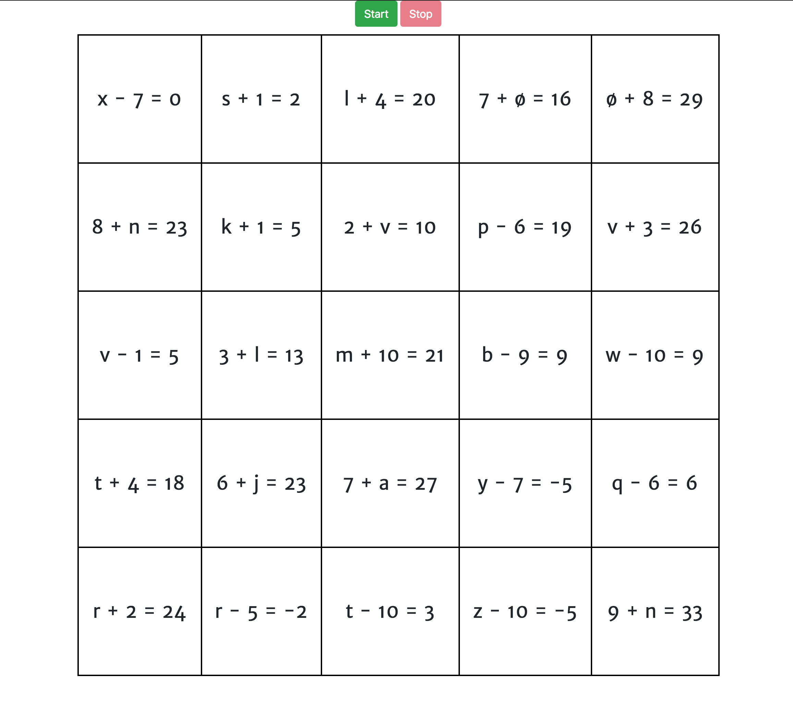

Demo available at [https://esoteric-puzzles.github.io/gilelah-tables/](https://ivarmah.github.io/gilelah-tables/).

Custom [Schulte table](https://en.wikipedia.org/wiki/Schulte_table) generator with more advanced settings.

## Start

Run `ng serve` for a dev server. Navigate to `http://localhost:4200/`. 
## Build

Run `ng build` to build the project. The build artifacts will be stored in the `dist/` directory. Use the `-prod` flag for a production build.
